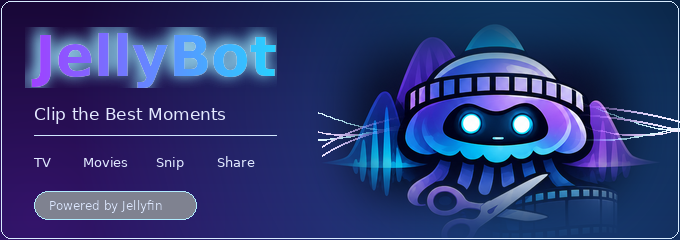

# Jellybot



Discord slash command bot that searches your local Jellyfin library and posts video clips back to the channel.

[](https://github.com/introVRt-Lounge/jellybot/actions/workflows/ci.yml)
[](LICENSE)
[](https://introvrt-lounge.github.io/jellybot/)
[](https://github.com/introVRt-Lounge/jellybot/pkgs/container/jellybot)

Links: [Contributing](CONTRIBUTING.md) · [Security](SECURITY.md) · [Support](SUPPORT.md) · [Docs](https://introvrt-lounge.github.io/jellybot/) · [Discord setup](DISCORD_SETUP.md)

## What it does

- `/clip` with a required `kind` choice: **Movie** or **TV episode**
- `/quote` searches indexed subtitles and clips the matching scene
- Jellyfin media autocomplete scoped to that kind
- `start` plus either `end` or `duration`
- ffmpeg extracts the segment from Jellyfin and uploads the MP4 to Discord

See [docs/COMMANDS.md](docs/COMMANDS.md) for the command contract and [DISCORD_SETUP.md](DISCORD_SETUP.md) for portal settings, permissions, and verification.

## Requirements

- Bun 1.3+ for local dev
- ffmpeg on `PATH` for non-container local runs
- Jellyfin reachable from the bot host
- Discord bot token with `applications.commands` scope

## Setup

```bash
git clone https://github.com/introVRt-Lounge/jellybot.git
cd jellybot
cp .env.example .env
bun install
```

Required env vars:

- `DISCORD_TOKEN`
- `DISCORD_CLIENT_ID`
- `JELLYFIN_USERNAME`
- `JELLYFIN_PASSWORD`
- `JELLYFIN_MOVIES_LIBRARY_ID`
- `JELLYFIN_TV_LIBRARY_ID`

Find library IDs in the Jellyfin dashboard under each library's settings, or via the Jellyfin API.

Optional:

- `JELLYFIN_URL` (default `http://127.0.0.1:8096`)
- `DISCORD_GUILD_ID` - instant guild command sync during development
- Clips render as **480p H.264** with AAC audio. Discord's inline player does not reliably decode HEVC/x265 (audio plays, video freezes).
- `MAX_CLIP_SECONDS` (default `180`)
- `MAX_CLIP_MB` (default `9`, capped by Discord's per-server `attachment_size_limit`; bots default to **10 MB** on non-boosted servers)
- `HEALTH_PORT` (default `8080`)
- `APP_VERSION` - shown on `/healthz`
- `SUBTITLE_DB_PATH` (default `/var/lib/jellybot/data/subtitles.db`)
- `JELLYBOT_CLIP_DIR` (container path for ephemeral clips, default `/var/lib/jellybot/clips`)
- `SUBTITLE_LANGUAGES` (default `eng,en`)
- `SUBTITLE_DEFAULT_CLIP_SECONDS` (default `15`)
- `SUBTITLE_QUOTE_PADDING_SECONDS` (default `2`)
- `SUBTITLE_INDEX_CONCURRENCY` (default `4`)
- `SUBTITLE_INDEX_ON_STARTUP` (`off` or `incremental`)
- `CLIP_AUTOCOMPLETE_MAX_CONCURRENT` (default `3`)

## Run locally

```bash
bun run register-commands
bun run start
bun test
bun run secrets:staged
```

## Docker

Standard bot compose contract:

```bash
make test
make register-commands
make index-subtitles
make dev-refresh
make health
make logs
```

Before `/quote` works, build the subtitle index once:

```bash
make index-subtitles
```

That walks Jellyfin items with subtitles and stores cue text in SQLite FTS. Re-run `make index-subtitles-incremental` after new subtitle files appear in the library.

The runtime container:

- reads Jellyfin URL and credentials from `.env`
- exposes `GET /healthz` on port `8080`
- stores ephemeral clip files on the `jellybot-clips` volume (or a host bind mount via `docker-compose.override.yml`)
- stores the subtitle index SQLite database on the `jellybot-data` volume at `/var/lib/jellybot/data/subtitles.db`

### Production image (live GHCR)

CI publishes the runtime image to **GitHub Container Registry** under the **introVRt-Lounge** org:

| | |
|---|---|
| **Package page** | https://github.com/introVRt-Lounge/jellybot/pkgs/container/jellybot |
| **Pull URL** | `ghcr.io/introvrt-lounge/jellybot:latest` |
| **Also tagged** | `:main`, `:sha-<commit>` on each build; semver tags on `v*` releases |

```bash
docker pull ghcr.io/introvrt-lounge/jellybot:latest
export JELLYBOT_IMAGE=ghcr.io/introvrt-lounge/jellybot:latest
docker compose -f deploy/prod/docker-compose.yml up -d --force-recreate
```

Or set `JELLYBOT_IMAGE=ghcr.io/introvrt-lounge/jellybot:latest` in `.env` next to [deploy/prod/docker-compose.yml](deploy/prod/docker-compose.yml).

## Jellyfin access model

The bot authenticates as the configured Jellyfin user (`JELLYFIN_USERNAME`), not an admin API key. Search and streaming follow that account's library access.

## Autocomplete notes

Discord validates later required options while autocomplete is open. That is why `start` is optional in the slash schema but enforced at runtime. Jellyfin searches are capped at 2.5 seconds and choice labels are compacted to Discord's 100-character limit.

## Example

```text
/clip kind:Movie media:The Matrix start:1:23:45 duration:30
/clip kind:TV episode media:Breaking Bad start:90 end:2:30
/quote match:love finds its way duration:15
```

Timestamp formats: `90`, `90s`, `1:30`, `01:02:03`.

## License

MIT - see [LICENSE](LICENSE).
