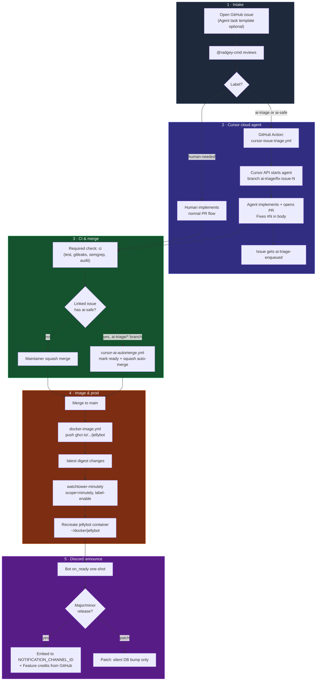

# Issue to deployment

End-to-end path from a GitHub issue to code running in production on the operator host. This is the **label-gated Cursor agent** flow plus the **Watchtower** delivery layer that follows every merge to `main`.

For day-to-day contributor rules, see [CONTRIBUTING.md](../CONTRIBUTING.md). For repo settings and secrets, see [REPO_SETTINGS.md](../REPO_SETTINGS.md).

## At a glance



## Roles

| Role | Who / what | Responsibility |
| --- | --- | --- |
| **Operator** | You | File issues, set acceptance criteria, merge non-automated PRs, prod `.env` |
| **Triage** | `@radgey-cmd` | Adds `ai-triage` or `ai-safe` when an issue is ready for Cursor |
| **Cursor cloud agent** | [cursor.com/agents](https://cursor.com/agents) | Implements on `ai-triage/fix-issue-N`, opens PR with `Fixes #N` |
| **GitHub Actions** | Workflows under `.github/workflows/` | Enqueue agent, run CI, optional auto-merge |
| **Watchtower** | `watchtower-minutely` on operator host | Pulls new `:latest` and recreates labeled containers ~every 60s |

## Phase 1 — Intake

1. Open an issue describing the goal, constraints, and acceptance criteria. The **Agent task** template (`.github/ISSUE_TEMPLATE/agent_task.yml`) is a good starting point.
2. **Do not** add `ai-triage` yourself. Triage is intentional: `@radgey-cmd` reviews scope and risk first.
3. Guard labels (manual): `ai-investigate-only`, `ai-no-db`, `ai-no-auth`, `human-needed`. Only `human-needed` is enforced by automation today (blocks auto-merge path).

## Phase 2 — Agent enqueue

When `@radgey-cmd` adds **`ai-triage`** or **`ai-safe`**:

1. **Workflow:** [`.github/workflows/cursor-issue-triage.yml`](../.github/workflows/cursor-issue-triage.yml)
2. **Trigger:** `issues.labeled` — only from sender `radgey-cmd`, only those two labels.
3. **Action:** POST to Cursor Cloud Agents API (`CURSOR_API_KEY` repo secret).
4. **Branch contract:** `ai-triage/fix-issue-{number}`.
5. **Marker:** label **`ai-triage-enqueued`** on the issue (prevents duplicate starts).

Monitor the run at [cursor.com/agents](https://cursor.com/agents) (Cloud Agents — not Cursor Dashboard **Automations**, which are PR-scoped).

**One-time setup:** Cursor GitHub integration for this repo + `CURSOR_API_KEY` in repo secrets. See [REPO_SETTINGS.md](../REPO_SETTINGS.md#cursor-cloud-agent-label-gated).

## Phase 3 — Pull request & CI

The agent (or a human) opens a PR to `main`. Substantive PRs need:

- Non-empty **Summary** and **Test plan**
- **`Fixes #N`** or **`Closes #N`** when the issue should close on merge

**Required check:** aggregate job **`ci`** (Docker test suite, `bun audit`, gitleaks, Semgrep).

### Auto-merge (`ai-safe` only)

[`.github/workflows/cursor-ai-automerge.yml`](../.github/workflows/cursor-ai-automerge.yml) enables squash **auto-merge** when **all** of:

| Condition | |
| --- | --- |
| Head branch | `ai-triage/*` |
| Linked issue | has **`ai-safe`** (copied to PR if missing) |
| PR body | contains `Fixes #N` / `Closes #N` |
| Blockers | issue must **not** have `human-needed` |
| CI | required check **`ci`** = success |

Draft agent PRs are marked **ready for review** automatically. Issues labeled **`ai-triage`** without **`ai-safe`** still need a human squash merge after green CI.

## Phase 4 — Container image

Every push to **`main`** runs [`.github/workflows/docker-image.yml`](../.github/workflows/docker-image.yml):

- Builds and pushes **`ghcr.io/introvrt-lounge/jellybot`**
- Tags: `:main`, `:sha-<commit>`, and **`:latest`** on `main` pushes
- **Patch-only semver release tags** (`v1.0.1` when previous was `v1.0.0`) skip the image push — `:latest` does not move for patch-only GitHub Releases

Package: [github.com/introVRt-Lounge/jellybot/pkgs/container/jellybot](https://github.com/introVRt-Lounge/jellybot/pkgs/container/jellybot)

## Phase 5 — Production deploy (automatic)

Production compose lives on the operator host at **`~/docker/jellybot/`** (not the dev checkout). The running service:

```yaml
# ~/docker/jellybot/docker-compose.yml (excerpt)
image: ghcr.io/introvrt-lounge/jellybot:latest
labels:
  - com.centurylinklabs.watchtower.enable=true
  - com.centurylinklabs.watchtower.scope=minutely
```

**`watchtower-minutely`** (server core stack) runs with `--interval 60 --scope minutely --label-enable`. When `:latest` digest changes, Watchtower recreates **`jellybot`** — no manual `docker compose pull` in normal ops.

| Event | Prod container updates? |
| --- | --- |
| Merge to `main` (new `:latest`) | Yes — within ~60s |
| Patch GitHub Release only | No — image publish skipped |
| `.env` change only | No — until next recreate (or manual `compose up -d --force-recreate`) |

Dev tree **`~/coding/jellybot-dev`**: use `make dev-refresh` for local container `jellybot-dev`. See [DEVELOPMENT.md](DEVELOPMENT.md).

## Phase 6 — Release announce

On **`ClientReady`** (once per container start), the bot checks GitHub Releases:

1. Compare latest tag to `last_announced_release` in `bot-state.db`
2. **Patch** releases: update DB silently — no Discord post
3. **Major/minor**: optional grace period, summarize notes (OpenAI if configured), post embed to **`NOTIFICATION_CHANNEL_ID`**
4. **Feature credits:** embed field listing `feat:` commits in the release range with GitHub display names (PR author when `(#NNN)` present)

Details: [architecture.md — Production release announce](architecture.md#production-release-announce).

## Human vs agent quick reference

| Step | Agent path (`ai-safe`) | Human / `ai-triage` only |
| --- | --- | --- |
| Issue filed | Yes | Yes |
| Radgey labels | `ai-safe` | `ai-triage` |
| Implementation | Cursor cloud agent | Human or agent |
| Merge | Auto after green `ci` | Manual squash |
| Deploy | Watchtower on `:latest` | Same |
| Announce | On next major/minor boot | Same |

## Troubleshooting

| Symptom | Likely cause | Check |
| --- | --- | --- |
| Label added, no agent | Wrong labeler, workflow error, missing `CURSOR_API_KEY` | Actions → **Cursor Issue Triage**; issue labels |
| Agent runs, no PR | Still working or failed in Cursor UI | [cursor.com/agents](https://cursor.com/agents) |
| PR green, not merging | Not `ai-safe`, wrong branch prefix, or draft/CI pending | Actions → **Cursor AI auto-merge** |
| Merged, prod unchanged | Patch-only release tag, or Watchtower/logs | GHCR `:latest` digest; `docker logs watchtower-minutely` |
| No Discord announce | Patch release, channel ID/env, or already announced | `NOTIFICATION_CHANNEL_ID`, `bot-state.db` |

## Related files

| File | Purpose |
| --- | --- |
| `.github/workflows/cursor-issue-triage.yml` | Start Cursor agent from issue labels |
| `.github/workflows/cursor-ai-automerge.yml` | Auto-merge eligible agent PRs |
| `.github/workflows/ci.yml` | Required `ci` gate |
| `.github/workflows/docker-image.yml` | GHCR publish |
| `deploy/prod/docker-compose.yml` | Production compose template |
| `src/release/release-announcer.ts` | Discord release embeds |
| `docs/DEVELOPMENT.md` | Dev vs prod trees |
| `docs/architecture.md` | Data paths, announce config |
