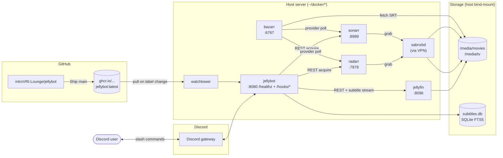
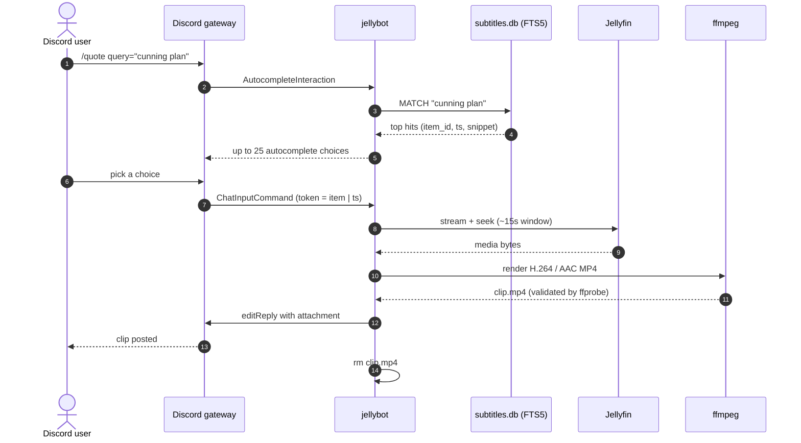
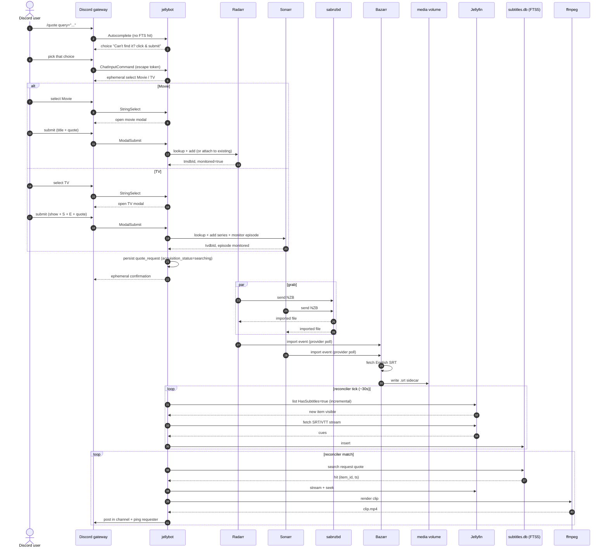
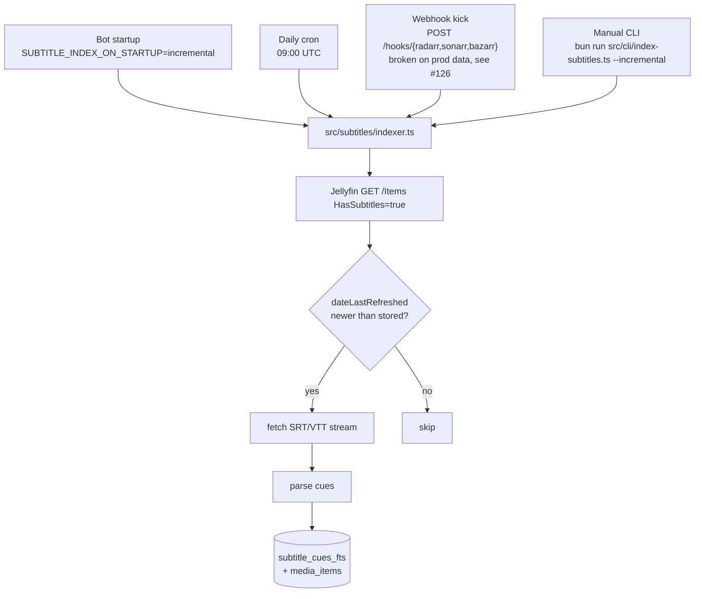
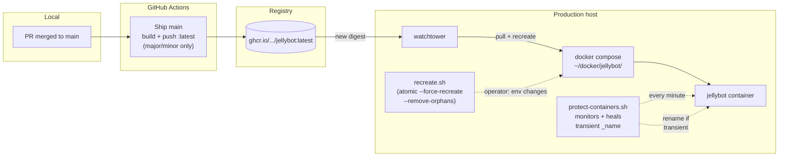

# Architecture

## Visual map

Five diagrams, top-down, from where the bytes live to where the user sees a clip. GitHub renders mermaid natively; click any node to read the prose section that backs it up.

### 1. System topology

Containers, storage, and the GitHub deploy edge.

### 2. `/quote` happy path

Subtitle is already indexed. Keystroke to clip in a couple of seconds.

### 3. `/quote` miss → acquisition

The big one. User asks for a quote we don't have, bot acquires the media, fetches subs, indexes, then auto-posts the clip.

### 4. Subtitle index triggers

Four paths feed the same indexer. The webhook path is wired but currently a no-op until [#126](https://github.com/introVRt-Lounge/jellybot/issues/126) lands; safety nets cover it meanwhile.

### 5. Deploy + self-heal

How code gets to production and how the host keeps containers honest.

## Components

| Piece | Role |
|-------|------|
| Discord gateway | Slash commands, autocomplete, file upload |
| Jellyfin client | Authenticates as `JELLYFIN_USERNAME`; searches and streams media |
| ffmpeg | Renders H.264/AAC MP4 clips |
| SQLite FTS | Subtitle index for `/quote` |
| Health server | `GET /healthz` on port 8080 |

## Data paths (container)

| Path | Purpose |
|------|---------|
| `/var/lib/jellybot/clips` | Ephemeral rendered MP4s (deleted after upload) |
| `/var/lib/jellybot/data/subtitles.db` | Subtitle FTS index (derived cache; see below) |
| `/var/lib/jellybot/data/bot-state.db` | Release announce dedupe (`last_announced_release`) |

## Production release announce

On **every bot restart** (including Watchtower image upgrades), `ClientReady` runs a **one-shot** release check:

1. `GET /repos/{owner}/{repo}/releases/latest` with `GITHUB_TOKEN`
2. Compare `tag_name` to `last_announced_release` in `bot-state.db`
3. **Patch** (`vX.Y.Z` where `Z > 0`): update DB silently, no Discord post
4. **Major/minor**: optional 60s grace, re-fetch, summarize notes (OpenAI when configured), embed to `NOTIFICATION_CHANNEL_ID`

There is **no** scheduled/hourly poll. Repeat restarts on the same release are no-ops via DB dedupe.

Required prod env: `GITHUB_TOKEN`, `NOTIFICATION_CHANNEL_ID` (introVRt Lounge announcements: `1159798255295660103`). Major/minor embeds include **Feature credits** from GitHub `feat` commits/PR authors in the release range, and **Community thanks** when closed issues in the release include `Reported by @githubLogin` (Discord pings use `src/release/github-discord-members.ts`).

Retroactive patch announce (operator): `bun run announce:release v1.2.2 --allow-patch` with prod env loaded.

Release pipeline: conventional commits → release-please → GitHub Release → CI pushes GHCR (`:latest` on major/minor only) → Watchtower recreates container → announce on boot.

## Subtitle index

The FTS database is **derived** from Jellyfin VTT streams (rebuildable via `make index-subtitles`) but **expensive** to regenerate: a full library pass can take hours.

### Size (measured + projected)

| Scale | Raw cue text | DB file (legacy trigram) |
|-------|--------------|---------------------------|
| ~5,100 items (~49%) | **157 MiB** | **2.43 GiB** |
| ~10,409 items (full Jellyfin-subtitled pool) | **~319 MiB** (projected) | **~4.9 GiB** (projected, trigram) |

Disk is dominated by the **FTS5 inverted index**, not subtitle prose. Legacy schema used `tokenize='trigram'` (~71% of bytes in `subtitle_cues_fts_data`). New deployments migrate to **`unicode61`** word search (smaller index; see [#27](https://github.com/introVRt-Lounge/jellybot/issues/27)). Migration rebuilds FTS from existing `subtitle_cues` rows on startup.

Treat `subtitles.db` as **state worth backing up**, not ephemeral bot state. Clips under `/var/lib/jellybot/clips` remain ephemeral.

### Backup (operator)

| | |
|---|---|
| **Host path** | `~/docker/jellybot/data/subtitles.db` (bind mount via `JELLYBOT_DATA_HOST_DIR`) |
| **Backup job** | `server-setup/scripts/backup/backup_docker_comprehensive.sh` → `docker_comprehensive.borg` |
| **Also in** | `coding.borg` backs up the git checkout only — **not** runtime DB unless under `~/coding` |

Avoid Compose **named volumes** for this DB; they sit under `/var/lib/docker/volumes/` and are outside the standard Borg path list.

### Index maintenance

- **On startup:** incremental index (`SUBTITLE_INDEX_ON_STARTUP=incremental`, default unless `off`)
- **Manual catch-up:** `make index-subtitles-incremental`
- **Full rebuild:** `make index-subtitles`
- **Progress:** `curl -s localhost:8080/healthz | jq .subtitleIndex`

## Deploy shapes

- **Dev:** `docker compose --profile app` from the repo checkout
- **Prod:** `deploy/prod/docker-compose.yml` with `JELLYBOT_IMAGE=ghcr.io/introvrt-lounge/jellybot:latest` and Watchtower labels

CI publishes the runtime image to GHCR on every push to `main`. **Patch** semver tags do not move `:latest`; **major/minor** tags do, which triggers Watchtower and the on-boot release announce.
